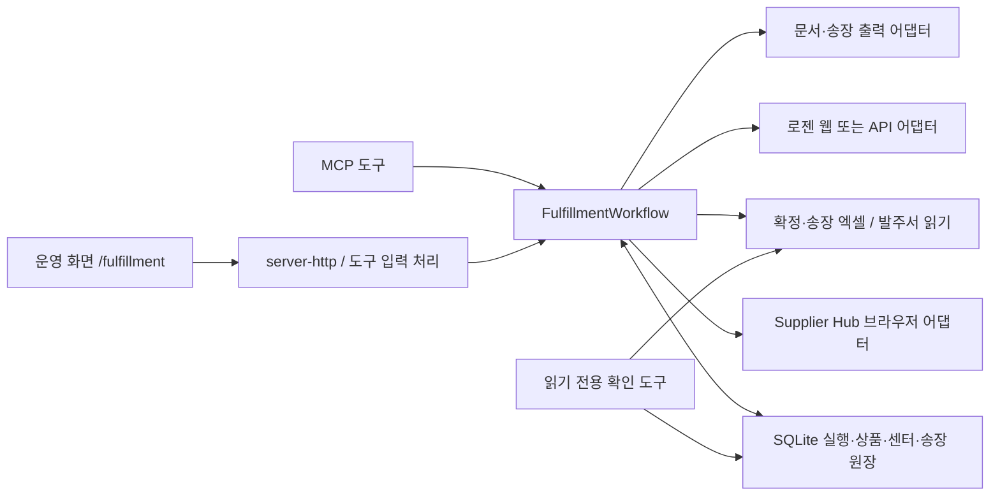
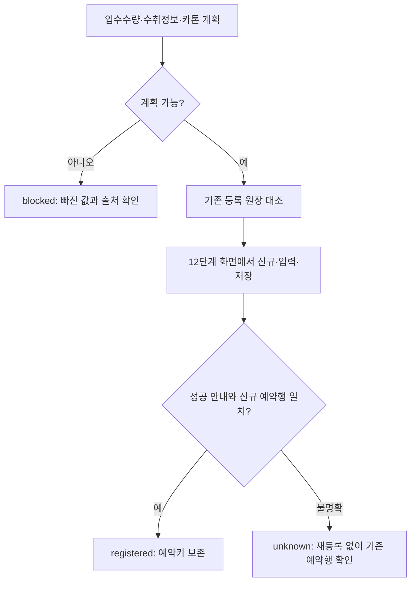

# Supplier Hub 발주·배송 자동화 개발 명세 및 확인 절차

작성일: 2026-09-14  
대상: `coupang-supplierhub-mcp` 본래 운영 페이지 `/fulfillment`  
기준: 현행 16단계, 실행 원장 `workflowVersion = 3`

## 1. 현재 결론과 확인 범위

**현재 13단계 중단 원인은 신규 SKU의 입수수량 누락이다. 로젠 저장 버튼을 누른 뒤 실패한 사례가 아니다.**

| 항목 | 확인 결과 |
| --- | --- |
| 실행 | `run-a19f4407-405` |
| 발주 / 센터 | `140802144` / 대구6 |
| SKU | `70924435` |
| 품목 | 코멧 홈 BPA FREE TPU 걸이형 양면 도마_L_차콜 |
| 발주수량 | 200개 |
| 12단계 | 원장상 완료: 주문등록/출력(단건) 화면 이동 |
| 13단계 | `blocked`: 입수수량이 없습니다. 배치 등록 0건, 카톤 계획 0건 |
| 14단계 | `blocked`: 출력할 로젠 PO·SKU 배치가 없습니다. |
| 현재 입수수량 출처 | 상품 기준정보에 해당 SKU 없음. 발주서에서 읽은 품목에도 값 없음 |
| 근거 있는 계산 가정 | 50개입 → 200 ÷ 50 = 4카톤 |
| 가정의 한계 | 기존 유사 TPU 도마의 포장 기준이다. 신규 SKU의 포장 규격과 동일하다는 직접 증거는 아님 |
| 이번 실제 조치 | 문서 재작성, 원본 파일·원장 대조, 읽기 전용 확인 도구 추가, 현재값/50개입 가정 비교 |
| 미실행 | 입수수량 가정의 운영 저장, 로젠 신규 등록, 송장 인쇄, 쉽먼트 업로드 |

근거 파일:

- [현재 원장 기준 확인 결과](evidence/stage13-current-2026-09-14.json)
- [50개입 가정 비교 결과](evidence/stage13-assumption-50-2026-09-14.json)

위 JSON의 `carton_plan_ready`는 카톤 계산이 가능하다는 뜻이다. 로젠 접속, 수취 정보, 운임, 저장 성공, 실제 출력까지 확인했다는 뜻이 아니다.

## 2. 기획 근거와 문서 우선순위

기존 기획의 단계 구분과 확인 원칙을 유지한다. 문서에서 모순이 발견되면 현재 실행 증거와 구분해 적는다.

| 근거 | 사용 목적 | 주의할 점 |
| --- | --- | --- |
| [기존 workflow-concept.html](../../coupang-supplierhub-mcp-oz-sandbox/public/workflow-concept.html) | 1~16단계의 업무 목적, 로그인/화면 이동/신규 저장 분리, 상태 재조회 원칙 | 보관된 사본이며 상단에 14단계 문구가 남아 있다. 본문의 16단계 역할을 읽는다. |
| [2026-07-31 인수인계](../../SupplierHub-Logen-MCP-Handoff-2026-07-31.md) | 저장 기준정보 우선, 발주서 대체 정보, 중복 방지, 단계별 실연동 확인 원칙 | 당시 14단계 번호·실행·테스트 수는 과거 기록이다. |
| [현재 README](../README.md) | 실행 방법, 환경변수, 웹/API 방식, 최근 구현 구성 | 기능 존재 및 자동 테스트 통과와 실제 외부 처리 완료를 구분한다. |
| [업무 오케스트레이터](../src/fulfillment-workflow.ts) | 현행 단계 처리·선행 조건·중복 방지 | 일부 메시지의 “v2” 표기보다 원장의 `workflowVersion`을 우선한다. |
| [실행 원장 및 확인 결과](evidence/stage13-current-2026-09-14.json) | 이번 발주의 단계별 실제 저장 상태 | 로컬 완료 기록이 물리 출력물 확인까지 대신하지는 않는다. |
| 다운로드한 발주서 | 상품·센터·수량의 원본 대조 | 없는 열이나 값을 다른 수량으로 바꿔 해석하지 않는다. |

확인 결과의 표현은 다음 네 가지로 구분한다.

1. **원본 확인:** 파일의 셀, 화면, 저장 원장에서 직접 확인한 값.
2. **계산 확인:** 확인된 값 또는 명시한 가정을 넣어 계산한 결과.
3. **실연동 확인:** 외부 서비스의 결과 화면/행/상태를 읽어 확인한 결과.
4. **추론:** 유사 품목·과거 기록에서 도출한 후보. 운영 기준정보와 구분한다.

## 3. 업무 목적과 범위

Private Label 발주를 조회·분류하고, 선택한 발주를 확정·출력한 뒤 로젠 배송 등록, 송장, 쿠팡 쉽먼트 및 문서까지 연결한다.

범위는 다음과 같다.

- 동일 발주가 중복 실행에 배정되지 않도록 관리한다.
- 거래처확인요청 발주만 5~7단계에서 확정한다. 이미 확정된 발주는 해당 구간을 생략한다.
- 로젠은 발주+SKU 단위로 등록하고, 카톤별 송장과 예약행을 연결한다.
- 센터·입고예정일이 같아도 발주번호가 다르면 별도 쉽먼트로 연결한다.
- 결과가 불명확한 등록·업로드·인쇄를 자동 반복하지 않는다.
- 기존 발주·송장 이력과 기준정보를 보존하고 필요한 대상만 재개한다.

`/practice`는 브라우저 안의 가상 예제이다. 운영 계정, 신규 SKU의 기준정보, 실제 주문등록, 출력 장치의 동작을 검증하는 수단으로 사용하지 않는다.

## 4. 구성과 책임



| 계층 | 파일 | 책임 |
| --- | --- | --- |
| 시작·구성 | `src/server.ts` | 환경변수, 저장소·어댑터 연결, 서버/예약 실행 |
| HTTP | `src/server-http.ts` | 화면 제공, 상태 조회, 도구 요청·MCP 전송 |
| 화면 입력 | `src/server-tool-handlers.ts` | 도구 이름과 메서드 연결, 입력 형식 처리 |
| MCP | `src/server-mcp.ts`, `src/fulfillment-mcp.ts` | 도구 계약, 스키마, 응답 |
| 업무 순서 | `src/fulfillment-workflow.ts` | 단계·선행 조건·부분 결과·재개 |
| 계획 계산 | `src/fulfillment-planning.ts` | 발주+SKU 배치, 카톤, 발주별 쉽먼트 계획 |
| 원장 | `src/fulfillment-store.ts`, `src/fulfillment-store-schema.ts` | 실행, 단계 결과, 상품·센터, 등록·출력 상태 |
| 브라우저 | `src/fulfillment-adapters.ts`, `src/persistent-chrome-session.ts` | 접속·화면·입력·결과 읽기 |
| 로젠 API | `src/logen-api-adapter.ts`, `src/logen-api-environment.ts` | API 환경 및 요청·응답 처리 |
| 문서 | `src/xlsx-order-reader.ts`, `src/order-confirmation-workbook-adapter.ts`, `src/shipment-workbook-adapter.ts` | 원본 읽기와 업무 파일 작성 |
| 쉽먼트 | `src/shipment-fulfillment-adapters.ts`, `src/fulfillment-v2-adapters.ts` | 업로드 준비·제출·연결·문서 |
| Windows 송장 | `src/logen-windows-print-client.ts`, `src/logen-windows-print-mcp.ts` | 송장 인쇄 대화상자 처리 |
| 확인 도구 | `scripts/inspect-fulfillment.mjs` | 원장·발주서의 값 출처 및 카톤 계획 비교. 운영 저장 없음 |

## 5. 데이터 계약과 단위

### 5.1 식별자

| 식별자 | 의미 / 전달 |
| --- | --- |
| `scanId` | 2단계 조회 스냅샷. 3~4단계로 전달 |
| `runId` | 4단계 실행 배정. 이후 단계에서 동일 실행 사용 |
| `orderNo` | 쿠팡 발주번호. 발주서·SKU·쉽먼트 연결 기준 |
| `skuCode` | 상품 기준정보 조회 키. 유사한 상품명만으로 다른 SKU 기준정보를 확정하지 않음 |
| `fixTakeNo` | 로젠 중복 방지용 발주+SKU 식별자 |
| `registrationKeys` | 로젠 저장 후 실제 예약행을 다시 찾는 키 목록 |
| `cartonIndex` | 배치 안의 상자 순번. 정상 카톤은 1부터 시작 |
| `slipNo` | 사용할 것으로 확정한 송장번호. 후보 번호와 구분 |
| `shipmentId` | 쿠팡에서 연결된 쉽먼트 번호 |

### 5.2 수량

| 필드 | 단위 | 의미 |
| --- | --- | --- |
| `orderedQuantity` | 상품 개수 | 현재 품목 처리의 기준 수량 |
| `unitsPerCarton` | 상품 개수/상자 | 카톤당 입수수량 |
| `cartonCount` | 상자 개수 | 발주수량을 입수수량으로 나눈 카톤 수 |
| 로젠 배치의 총수량 | 택배 건수 | 현행 배치 어댑터에서는 카톤 수로 전달 |
| 송장 수 | 장수 | 정상 계획에서는 카톤 수와 일치 |

**현행 운영 계산은 나머지가 없는 포장만 허용한다.** 입수수량이 없거나 발주수량이 입수수량으로 나누어지지 않으면 해당 배치를 중단한다. 임의 올림·나머지 상자 처리를 적용하지 않는다. 이는 `planFulfillment()`와 `createCartonJobs()`의 현재 계약이다.

예: 200개 ÷ 50개입 = 4카톤. 200은 발주수량이며 입수수량이 아니다. `입고수량`도 입수수량과 다른 필드다.

### 5.3 발주서 포장 기준 자동 확인 (2026-09-15)

사용자 요청으로 정상 품목의 수동 체크·저장을 자동 판정으로 대체했다. 발주서 명시값이 유일하고, 모든 연결 파일에서 같은 SKU의 입수수량을 읽었으며, 저장값이 없거나 일치하고, 발주수량이 정확히 나누어지면 `automatic`으로 통과한다. 누락·불일치·수량 변경·계산 오류만 수동 예외 처리한다. 기존 등록 품목은 당시 수량을 유지한다.

화면 조회와 8단계 후 갱신에서 자동 판정하며 미리보기는 읽기 전용이다. 정상 품목은 체크·저장 버튼을 누르지 않고 13단계 등록 미리보기로 진행한다. 실제 13단계 실행은 파일을 다시 읽어 판정하고, 자동 확인 기록을 `method: automatic`으로 저장한다. 이 기록은 사람이 확인했다는 뜻이 아니다. 파일 변경 후에도 새 값이 정상이라면 자동 재계산하되, 변경 전 미리보기 토큰으로 등록하는 요청은 거부한다.

8단계 발주서를 준비하면 현재 파일을 읽어 SKU별 명시 입수수량과 시트·셀 위치, 포장 안내를 표시한다. `발주수량`과 `출고수량 / Shipped Qty`는 이번 발주의 카톤 입수수량으로 자동 채택하지 않는다. 인식되지 않는 양식과 누락값은 발주서를 열어 실제 포장 기준과 확인 근거를 입력한다.

| 화면 선택 | 확인 전 제안값 | 등록 적용값 |
| --- | --- | --- |
| 자동 `auto` | 발주서 명시값 우선, 없으면 저장된 SKU 기준 참고 | 이번 PO/SKU에 확인 저장한 수량 |
| 저장값 참고 `backend` | 저장된 SKU 기준 참고 | 발주서 대조 후 확인 저장한 수량 |
| 발주서 명시값 참고 `order_file` | 현재 발주서에서 읽은 명시값 | 발주서 대조 후 확인 저장한 수량 |

- 화면은 발주서 값·확인 위치·기존 저장값·이번 적용값·예상 카톤·확인 상태를 나란히 보여준다.
- `발주서 열기`는 현재 실행에 연결된 다운로드 XLSX만 Windows 기본 앱에 전달한다. 열기 요청 자체는 검토 완료로 저장하지 않는다.
- 명시값 누락, 파일 간 불일치, 저장값과 발주서 값 불일치, 발주서 값과 다른 적용값은 확인 근거가 필수다. 값이 명확하고 일치하면 자동 통과하며, 입력창은 접힌 상태로 표시한다.
- `confirm_carton_order_review`는 Run/PO/SKU별 적용값, 확인 근거, 시각, 파일 내용 해시와 수량 기준의 지문을 `fulfillment_carton_order_reviews`에 저장한다. 여러 행은 함께 검증하고 한 트랜잭션으로 기록한다.
- 파일 내용·경로, 발주수량, SKU 기준정보, 출처 선택이 바뀌면 이전 확인은 무효이고 자동으로 다시 판정한다. 화면에서 수량을 수정하면 예외 입력창을 펼치고 다시 대조한다.
- 13단계는 HTTP·MCP·개별·전체 실행 모두 현재 자동 판정 또는 유효한 수동 예외 기록을 검사한다. 미리보기 토큰을 생략해도 미해결 예외를 우회할 수 없다. 확인된 이번 발주 수량으로만 신규 카톤을 만든다.
- 이미 등록된 PO/SKU의 수량 및 등록 이력은 유지하며 재등록하지 않는다.
- 이번 발주 확인은 SKU 공통 기준을 자동 변경하지 않는다. 선택 항목의 `확인한 포장 기준 저장`으로 공통 기준까지 변경하면 자동으로 다시 대조하고 남은 예외만 요청한다.


## 6. 16단계별 개발·확인 명세

각 단계는 **입력 → 행동 → 결과 확인 → 저장 증거 → 실패 처리**를 갖는다. 다음 표의 확인을 통과해야 그 단계의 업무 완료로 판단한다.

| 단계 / 도구 | 입력과 행동 | 확인 방법·완료 증거 | 실패 시 처리 |
| --- | --- | --- | --- |
| 1. 접속 `open_supplierhub` | 전용 프로필로 Supplier Hub에 접속하고 Private Label 목록으로 이동 | 최종 URL·목록 준비 표시·로그인 상태. 일반 발주 목록과 구분 | 로그인 필요/접근 실패를 표시하고 조회로 진행하지 않음 |
| 2. 조회 `list_private_label_orders` | 날짜 기준과 범위를 정해 발주 조회 | 조회 조건, 발주번호·상태·센터·입고일 목록, 생성된 `scanId` | 결과가 없으면 0건과 조회 실패를 구분 |
| 3. 분류 `compare_new_orders` | 상태와 기존 실행 배정 여부 비교 | 확정 필요/이미 확정/미처리 재발견/제외 사유 | 오래된 분류는 같은 스캔으로 재분류 |
| 4. 배정 `select_orders_for_fulfillment` | 처리 가능 발주를 하나의 실행에 배정 | 선택 발주 목록, `runId`, 중복 배정 여부 | 기존 실행이 있으면 같은 실행으로 재개 |
| 5. 확정 양식 `download_order_confirmation_template` | 확정 필요 발주의 원본 양식 준비 | 실행별 파일 경로와 `order_confirmation_jobs.downloaded` | 이미 확정된 발주는 생략, 파일 미확보 건은 중단 |
| 6. 확정수량 `prepare_order_confirmation_workbook` | 선택 발주의 확정수량 작성 | 발주번호·발주수량·확정수량 열과 선택 행. 준비 파일 `prepared` | 잘못된 행/필수 열 누락만 해당 작업에서 표시. 첫 교정은 준비 파일 확인 |
| 7. 확정 `upload_and_confirm_private_label_orders` | 최신 상태 재확인 후 준비 파일 업로드 | 완료 안내만 보지 않고 선택 발주의 `발주확정` 상태 재조회 | 결과 불명확은 `unknown`, 자동 재업로드 금지 |
| 8. 발주서 `download_order_files` | 선택 발주서 다운로드, 품목·수취 정보 읽기 | 파일 경로·상품코드·수량·센터 및 품목 값 출처 | 기존 파일 재사용 가능. 다운로드 완료와 배송 기준정보 완성은 구분 |
| 9. 발주서 인쇄 `print_order_files` | 대상 파일·프린터·부수를 지정 | 어댑터의 인쇄 제출 결과와 `order_print` 기록 | 불명확한 제출을 자동 재출력하지 않음 |
| 10. 출력 기록 `record_print_result` | 9단계 결과를 다음 구간에 인계 | 원장에 인쇄 제출 결과가 있음. 실제 출력물 정상 여부는 별도 확인 | 제출 기록이 없으면 택배 처리 시작 중단 |
| 11. 로젠 로그인 `open_logen_login` | 실행별 웹/API 방식 고정, 웹이면 인증된 메인 화면 | 로그인 완료 표시와 최종 화면. 웹/API 방식이 실행에 일관되게 저장됨 | 로그인·방식 문제를 먼저 해결 |
| 12. 등록 화면 `open_logen_single_order_registration` | 예약관리 → 주문등록/출력(단건) 이동 | 신규(F3) 버튼이 보이는 정확한 화면. 아직 신규·저장하지 않음 | 준비 화면이 없으면 이 단계에서 복구 |
| 13. 신규·저장 `register_logen_delivery_order` | 기준정보로 카톤 계획 → 신규(F3) → 수하인·택배수량·운임 입력 → 저장(F5) | 저장 전 수량 출처/카톤/수취 정보. 저장 후 성공창과 신규 예약행 키·수량 일치 | 제출 전 실패와 제출 후 `unknown` 구분. 아래 상세 절차 적용 |
| 14. 송장 `print_logen_waybill` | 저장된 예약행 선택 후 송장 인쇄 | 미출력/출력 양쪽 목록, 예약키, 카톤별 번호·장수, 프린터 결과 | 불명확한 재등록/재출력 금지. 원송장/운송장 후보가 함께 있으면 사용할 번호 확인 |
| 15. 쉽먼트 `prepare_supplierhub_shipment_tracking` / `register_supplierhub_shipment_tracking` | 카톤별 확정 송장으로 파일 작성, 날짜·시간 지정, 준비와 제출 분리 | 준비는 첨부·요약 화면. 제출 후 작업 결과 및 발주+센터+입고일에 맞는 `shipmentId` | 준비 성공을 등록 완료로 표시하지 않음. 불명확한 업로드는 원장 유지 |
| 16. 문서 `print_supplierhub_shipment_documents` | 연결된 쉽먼트의 라벨·내역서 출력 | 문서 종류·대상 발주·출력 제출 기록, 현물 확인 | 결과 불명확은 자동 재출력하지 않고 확인 |

파일 확인은 업무에 필요한 값과 선택 행에 집중한다. ZIP 전체 항목 수, 일괄 해시, 모든 XLSX 셀·서식을 매 단계 반복 검증하지 않는다.

## 7. 13단계 상세 설계

### 7.1 등록 전

1. 대상 `runId`와 선택 발주·SKU가 맞는지 읽는다.
2. 각 SKU의 입수수량을 5.3절의 출처 우선순위로 결정한다.
3. 입수수량이 양의 정수이고 발주수량을 나머지 없이 나누는지 확인한다.
4. 발주+SKU 배치 수, 카톤 수, 이후 기대 송장 수를 확정한다.
5. 송하인·센터 수취 정보와 거래처코드·운임을 준비한다.
6. 등록 완료·출력 완료 또는 결과 불명확한 기존 배치는 재등록 대상에서 제외한다.
7. 웹 방식은 12단계에서 준비한 단건 등록 화면을 그대로 사용한다.

이번 발주는 **2번에서 값이 없고 3~4번의 카톤 계획을 완성하지 못한 사례**다. 원장상 13단계에서 웹 등록을 시작하지 않았다.

### 7.2 저장과 결과 확인

1. 등록 전 미출력 예약행 목록을 읽는다.
2. 신규(F3)를 눌러 입력하고 수하인·택배 건수·운임 등을 채운다.
3. 저장(F5)을 호출하기 전에 원장에 진행 중 요청을 남긴다.
4. 저장 성공 안내를 확인한다.
5. 신규 예약행을 다시 읽어 키와 수량이 등록 대상과 일치하는지 확인한다.
6. 성공한 경우에만 `registered`, 예약키, 등록 시각을 저장한다.
7. 저장 요청 후 응답/예약행 확인이 불분명하면 `unknown`으로 보존한다.



### 7.3 재시작과 중단 실행

- 현재 브라우저 등록 화면 핸들은 서버 메모리에 있다. 서버를 재시작하면 원장의 12단계 완료 기록만으로 화면 연결이 복원되지는 않는다.
- 따라서 11~14단계 실작업 중 서버를 무심코 재시작하지 않는다. 재시작 후에는 기존 외부 등록 여부부터 확인하고 필요한 로그인·화면 이동을 복구한다.
- 이번 사건의 직접 원인은 재시작이 아니라 `unitsPerCarton` 누락으로 기록돼 있다. 별도의 재시작 취약점과 혼동하지 않는다.
- `unknown`을 지우거나 새 `runId`를 만들어 회피하지 않는다. 기존 예약행·원송장·운송장 상태를 먼저 대조한다.

## 8. 이번 발주 원본 대조와 50개입 추론

### 8.1 다운로드 발주서에서 직접 확인한 값

파일: `data/fulfillment-downloads/orders/run-a19f4407-405/140802144/발주서_140802144.xlsx`  
시트: `PO_140802144`

| 셀 / 위치 | 원본 내용 | 해석 |
| --- | --- | --- |
| B25 | 70924435 | 이번 SKU |
| C25 | 코멧 홈 BPA FREE TPU 걸이형 양면 도마_L_차콜 | 품목·규격 표기 |
| G23 / G25 | 발주수량 / 200 | 주문 상품 수량 |
| H23 / H25 | 업체납품가능수량 / 200 | 공급 가능한 상품 수량 |
| I23 / I25 | 입고수량 / 0 | 입고된 상품 수량. 입수수량으로 해석하지 않음 |
| C26 | PL04002680432 | 바코드 |
| 상품 상세행·메시지·회송 영역 | 입수수량 표기 없음 | 이 원본의 200이나 0으로 포장 단위를 만들어내지 않음 |

기준정보 DB에서도 `product_master.sku_code = '70924435'` 조회는 0건이다. 읽은 품목에는 `orderedQuantity = 200`만 있고 `unitsPerCarton`이 없다.

### 8.2 기존 자료를 활용한 추론

| 근거 | 확인된 사실 | 이번 SKU에 대한 의미 |
| --- | --- | --- |
| 기존 카톤 계산 파일의 `상품목록` M열 | SKU 44133530 TPU 차콜 도마: 50개입, 100개 → 2카톤 | 같은 제품군·색상의 기존 포장 기준 |
| 같은 파일의 SKU 57870533 | BPA FREE TPU 도마 아이스블루: 50개입, 200개 → 4카톤 | 유사 제품군에서 50개입 기준이 반복됨 |
| `product_master`의 SKU 44133530 | 50개입, source=`backend` | 기존 운영 기준정보와 일치 |
| 과거 발주 137209097의 로젠 배치 | 100개, 50개입, 2카톤, `waybills_printed` 기록 | 실제 처리 이력이 있는 기준 |

두 원본 파일은 프로젝트 상위 `outputs` 폴더의 다음 파일이다.

- `ShipmentsUpload_PARCEL_20260730_작업용_카톤계산.xlsx`
- `ShipmentsUpload_PARCEL_20260730_송장입력준비.xlsx`

**계산 후보: SKU 70924435를 50개입으로 보면 200 ÷ 50 = 4카톤, 기대 송장 4장이다.** 신규 SKU와 기존 SKU의 포장이 같다는 직접 증거까지 확보한 것은 아니므로 현재 보고서의 출처는 `simulation_only`로 남긴다.

## 9. 재현 가능한 확인 명령

프로젝트 폴더에서 실행한다. 처음 소스를 내려받은 환경은 `npm run build`로 `dist`를 준비한다.

현재 저장된 값으로 확인:

```powershell
npm run inspect:fulfillment -- --run run-a19f4407-405
```

50개입 가정을 넣어 계산만 비교:

```powershell
npm run inspect:fulfillment -- --run run-a19f4407-405 --carton-units 70924435=50
```

출처별 확인이 필요할 때만 선택:

```powershell
npm run inspect:fulfillment -- --run run-a19f4407-405 --data-source backend
npm run inspect:fulfillment -- --run run-a19f4407-405 --data-source order_file
```

도구는 `DatabaseSync`를 `readOnly: true`로 연다. 서버의 업무 메서드, 브라우저, 프린터를 호출하지 않으며 기준정보와 실행 결과를 저장하지 않는다. `--carton-units`는 보고서 계산에만 적용된다.

| 이번 확인 | 결과 |
| --- | --- |
| 현재 원장 그대로 | `missing`, 카톤 0, `blocked` |
| 70924435=50 가정 | `simulation_only`, 카톤 4, `carton_plan_ready` |
| DB 변경 | 0 |
| 외부 요청 | 0 |

## 10. 보완 기능 구현과 남은 공백

### 운영 화면의 준비 묶음과 눈으로 검토하는 단계

| 화면 묶음 | 기존 단계 | 묶음 종료 지점 |
| --- | --- | --- |
| 01 · 발주 준비 | 1~6 | 확정수량 작성 후 발주 검토 대기 |
| 02 · 확정과 발주서 | 7~10 | 발주서 인쇄 결과 기록 후 종료 |
| 03 · 로젠 배송 | 11~14 | 로젠 송장 출력 또는 송장번호 확인 대기 |
| 04 · 입고 마무리 | 15~16 | 쉽먼트 문서 출력 후 종료 |

첨부 예시의 분류 명칭과 상태 체크 목록을 적용하되, 앞서 합친 1~6 범위를 유지해 5~6단계는 첫 묶음에 한 번만 배치했다. 체크 목록은 저장된 단계 상태와 이번 실행 결과를 반영한다. 저장 기록이 없는 1~3 조회 단계는 `개별 기록 없음`으로 표시한다.

- **1~6 준비 실행:** 기존 단계 번호와 API를 그대로 유지하면서 화면에서 한 블록으로 묶는다. 접속, 조회, 분류, 선택, 양식 다운로드, 확정수량 작성을 순서대로 실행하고 6단계에서 종료한다. 중간 중단·실패·부분 완료가 발생하면 다음 단계를 호출하지 않고 세부 이력을 펼친다.
- **눈으로 검토 · 발주확정 전 확인:** 선택한 발주번호, 센터, 입고예정일, 선택 발주의 상품 수량, 확정 준비 상태와 준비 파일 경로를 표시한다. 목록의 수량은 실행에 저장된 발주 정보이며, 엑셀 파일의 실제 셀 검수 결과로 표시하지 않는다. 작업자는 파일을 열어 품목별 발주수량과 확정수량을 대조한다.
- **파일 열기:** 검토 화면의 버튼은 `open_order_confirmation_file` UI API에 실행 ID·발주번호·화면에 표시된 파일 정보를 전송한다. 서버는 해당 실행의 확정 준비 기록에서 실제 XLSX 경로를 선택하고, 파일 변경 여부와 존재 여부를 확인한 뒤 Windows 기본 앱으로 열기를 요청한다. 경로는 명령 문자열에 삽입하지 않고 환경변수 데이터로 전달한다. 응답 `requested`는 Windows 열기 요청 성공이며, 사용자의 실제 검토 완료를 의미하지 않는다. 파일 열기로 단계 이력·검토 체크·업로드 상태를 변경하지 않는다.
- **검토 후 7단계 실행:** 새로 확정할 발주가 있을 때 화면의 개별 7단계와 묶음 실행 모두 검토 화면을 거친다. 발주 정보와 엑셀 수량 확인 체크를 모두 선택하고 진행 버튼을 눌러야 업로드한다. 닫기·Esc는 7단계 호출 없이 종료한다. 확인 직후 실행/발주/준비 파일 기록이 변경됐으면 다시 검토한다. 이는 화면의 실행 조건이며 기존 MCP API에 새 승인 상태를 추가한 것은 아니다.
- **묶음별 이어서 실행:** 현재 Run을 보존하고 7~10, 11~14, 15~16을 각각 실행한다. 이미 확정된 발주와 등록된 PO/SKU는 다시 제출하지 않으며, 완료된 다운로드·인쇄·쉽먼트 업무도 건너뛴다. 웹사이트 연결인 11~12는 다시 연결한다. 새 로젠 등록은 기존 미리보기를 거친다. 각 묶음 끝에서 종료하고 다음 묶음을 자동 시작하지 않는다.
- **부분 완료와 확인 필요:** 묶음 내 어느 단계든 부분 완료·중단·실패·결과 불명확이면 다음 단계 호출을 멈춘다. 특히 15단계 부분 완료는 16단계 출력을 호출하지 않는다. 완료된 묶음 버튼은 잠그며, 의도한 개별 재실행은 세부 단계에서 선택한다.
- **기존 실행 복구:** 저장된 4~6단계 이력으로 준비 완료 여부를 표시한다. 이미 발주확정된 실행은 검토할 수 있지만 추가 확정 버튼을 활성화하지 않는다.

기존 단계 번호 1~16은 변경하지 않는다. 화면의 검토 지점을 업무 단계 사이에 추가할 수 있도록 준비 묶음, 검토 영역, 후속 실행 영역을 분리했다.

가상 UI 확인에서 1~6 호출 순서와 6단계 종료, 검토 취소 시 7단계 미호출, 확인 후 같은 실행에서 7단계 1회 호출, 5단계 중단 시 6~7단계 미호출을 확인했다. 운영 발주/업로드/프린터는 이 검증에 사용하지 않았다.

후속 묶음 UI 확인에서는 7~10이 완료된 7·8을 건너뛰어 9·10만 호출하고 종료하는 것, 11·12 재연결 후 13 검토를 거쳐 14에서 종료하는 것, 15 부분 완료 시 16 미호출, 15 완료 기록을 복구한 뒤 16만 호출하는 것을 가상 실행으로 확인했다.

### 따라다니는 작업 도구

2026-09-14 운영 화면에 고정 위치의 작업창을 추가했다. 페이지 스크롤과 독립적으로 표시하며 제목 드래그·방향키 이동, 접기·펼치기, 기본 위치 복귀를 제공한다. 위치는 화면 안으로 제한하고 브라우저 저장소에 위치·접힘·모니터링 설정을 보관한다. 검토 모달이 열리면 작업 도구를 해당 모달 안으로 옮겨 녹화·조회·멈춤 버튼이 비활성화되지 않도록 하고, 상단의 작은 형태로 표시해 검토 본문과 겹치지 않게 한다.

| 도구 | 동작과 확인 기준 |
| --- | --- |
| 녹화 시작 / 중지 | 기존 화면 공유·MediaRecorder 흐름을 재사용한다. 사용자가 공유 대상을 선택하고, 중지 시 WebM 다운로드를 요청한다. 녹화 상태를 제목에도 표시한다. |
| 현재 실행 확인 | 선택 Run을 `get_fulfillment_run`으로 읽고 실행 결과에 표시한다. 실행·검토 중에도 조회할 수 있다. |
| 전체 실행 | 선택 Run은 5~16 범위에서 완료 기록을 건너뛰며 재개한다. 선택이 없으면 1~16을 진행한다. 기존 그룹 실행 함수를 재사용하되 그룹 끝에서 멈추는 제한만 명시적으로 해제한다. 7단계·13단계 검토, 14단계 송장 확인, 부분 완료·중단·실패·결과 불명확 시 중단 조건은 유지한다. |
| 완료 이력 재사용 | 확정·등록 증빙과 완료 단계는 다시 제출하지 않는다. 14단계가 완료된 Run을 전체 실행으로 재개할 때는 11~12단계 연결도 건너뛴다. |
| 모니터링 | 선택 Run만 5초마다 읽는다. 중복 조회를 막고 8초 응답 제한을 둔다. 응답 도착 전 선택 Run이 바뀌면 이전 응답을 버린다. 실행 중이나 검토 중에는 단계 UI·사용자 입력을 다시 그리지 않는다. 연결 오류와 마지막 확인 시각을 표시한다. |
| 다음 단계 전 멈춤 | 실행 중인 API 요청이 끝난 뒤 다음 단계 전 종료한다. 검토 대기는 취소로 닫는다. 서버에서 시작한 제출·인쇄 작업을 강제 중지하지 않는다. |

이 작업창은 운영 웹페이지 안에서 동작한다. 화면의 전체 실행은 검토를 거치는 개별 API 연속 호출이며, 무인 MCP 전체 실행과 예약 실행의 운영 모드 제한을 변경하지 않는다. 그룹 버튼은 계속 자기 구간 끝에서 종료한다.

가상 API를 사용한 UI 확인에서 드래그·접기·펼치기, 가상 녹화 시작/중지 상태, 검토 중 현재 실행 조회, 7단계 검토 중 멈춤 시 제출 0회, 동일 Run 재개 후 7~16 순차 호출과 13단계 검토 대기, 완료 후 재실행 시 추가 제출 0회를 확인했다. 실제 화면 녹화·업로드·등록·프린터는 사용하지 않았다.

### 13단계 등록 준비

2026-09-14 등록 준비 패널을 추가했고, 2026-09-15 **눈으로 검토 · 발주서 포장 기준 확인**으로 확장했다. 현재 필수 확인 규칙은 5.3절을 따른다. 발주서 다운로드 후, 실행 선택 후, 기존 실행 복구 후 자동 대조한다. 누락 SKU와 출처, 유사 품목의 추정 후보, 카톤 수, 등록 상태를 표시한다. 후보는 자동 확정하지 않는다.

| 기능 | 동작과 확인 기준 |
| --- | --- |
| `preview_logen_registration` | 읽기 전용. PO/SKU, 발주수량, 적용 입수수량·출처, 예상 카톤, 송수하인, 등록 이력과 보완 항목을 반환한다. `draftUnits`는 계산에만 사용하며 미저장 값으로 실제 등록할 수 없다. |
| `save_product_carton_units` | 사용자 확인 체크 후 SKU별 포장 기준을 저장한다. 양의 정수·정확한 나눗셈·현재 실행·기존 등록 이력·수정 전 값/시각을 검사한다. 여러 SKU는 한 트랜잭션으로 저장한다. |
| 변경 기록 | `product_master_changes`에 실행 ID, SKU, 이전/새 입수수량, 확인 시각과 확인 문구를 기록한다. 실행 삭제 시 변경 기록은 남고 실행 연결만 해제된다. |
| 같은 실행 재개 | 미제출 배송 계획만 교체하므로 입수수량 누락으로 생성된 카톤 0번 행을 정상 카톤 행으로 다시 계산한다. 기존 확정·출력 단계를 재실행하지 않는다. |
| 중복 등록 방지 | 등록키·등록 시각·출력 이력 또는 결과 불명확 상태가 있으면 계획을 보존한다. 사용자 확인 저장도 해당 SKU의 진행된 이력이 있으면 중단한다. |
| 최종 미리보기 | 개별 13단계와 화면의 연속 실행 모두 송수하인, PO/SKU, 수량, 카톤 수를 표시한 후 사용자의 등록 클릭을 받는다. 닫기는 13단계 호출 없이 종료한다. |
| 변경 감지 | 화면이 넘긴 `reviewToken`을 등록 직전 현재 계획과 대조한다. 기준정보·수취 정보·등록 이력이 달라졌으면 재확인을 요청한다. 기존 MCP 호출 호환을 위해 토큰 인자는 선택 사항이다. |
| 상태 표시 | HTTP 200이어도 업무 결과가 `blocked`, `failed`, `unknown`이면 완료로 표시하지 않는다. |
| 현재 발주서 양식 | `택배담당자`/`택배수령담당자`, `회송주소`/`회송지주소`를 모두 읽는다. 기존 실행의 수취 정보가 누락됐으면 다운로드된 같은 PO의 XLSX에서 읽어 미리보기에 표시하고, 실제 등록 시 기존 기준정보 저장 경로로 반영한다. 재다운로드는 하지 않는다. |

아래 최초 진단표의 P1 입력·누락 안내 항목은 위 기능으로 구현했다. 원본에 없는 입수수량을 발주수량이나 입고수량으로 대체하는 처리는 하지 않는다.

| 우선순위 | 확인된 공백 | 필요한 개발 내용 | 통과 기준 |
| --- | --- | --- | --- |
| P1 | 새로운 SKU에 입수수량이 없으면 13단계에서야 중단되고 운영 화면에 보완 경로가 없음 | 8단계 이후/13단계 전 품목별 입수수량·출처·카톤 계산을 보여주고, 확인된 기준을 저장할 입력 경로 제공 | 이번 SKU처럼 신규 상품일 때 누락이 보이고, 사용자가 확인한 값으로 계산을 다시 확인 가능 |
| P1 | `입수수량이 없습니다` 메시지만으로 대상·확인 위치를 파악하기 어려움 | 발주번호·SKU·조회한 출처·필요한 조치를 구조화해 표시 | 원장 전체 JSON을 읽지 않아도 막힌 품목을 식별 가능 |
| P1 | 표준 인쇄형 발주서에 입수수량이 항상 존재한다는 보장이 없음 | 원본에 명시된 입수수량이 있는 양식은 지원하고, 없는 양식은 다른 확정된 기준정보와 연결 | 발주/납품/입고 수량을 포장 단위로 오인하지 않음 |
| P2 | 서버 재시작 후 12단계 화면 핸들이 사라짐 | 기존 화면 연결 복구 또는 명확한 재연결 절차. 등록 이력은 보존 | 재시작을 주문 재등록으로 해결하지 않음 |
| P2 | 출력 요청 제출과 실제 현물 정상 출력의 의미가 혼재 | 제출 결과와 현물 확인을 구분한 상태·문구 | 9~10단계 완료를 실제 출력 확인으로 과장하지 않음 |
| P2 | 실습 페이지의 올림 계산과 운영의 나머지 없는 포장 규칙이 다름 | 실제 운영 교육에 사용할 경우 계산·중단 규칙을 맞춤 | 비정수 카톤 사례에서 실습과 운영의 안내가 일치 |

P2 항목은 별도 개선 과제로 남는다. 서버 재시작 후 웹사이트 연결은 같은 실행에서 11~12단계를 다시 연결하고, 기존 등록키를 초기화하지 않는다.

## 11. 이번 실행의 재개 절차

1. 기존 `run-a19f4407-405`를 유지한다. 1~10단계의 확정·출력 업무를 다시 수행하지 않는다.
2. 이번 SKU의 포장 기준을 확인한다. 현재 유력 후보는 50개입이다.
3. 운영 화면의 등록 준비 패널에서 후보 수량을 입력하고 **입력값으로 계산**한다. 맞는 포장 기준이면 확인 체크 후 **확인한 포장 기준 저장**을 누른다. SKU 공통 기준을 저장했다면 발주서 확인을 다시 저장한다.
4. 발주서를 열어 품목별 적용 수량과 근거를 입력하고 확인 체크 후 **발주서 확인 저장**을 누른다. **13단계 등록 미리보기**에서 이번 적용값과 예상 4카톤, 송수하인 정보를 확인한다. 같은 내용은 읽기 전용 진단 명령으로도 확인할 수 있다.
5. 기존 로젠 등록·예약행 여부를 확인한다. 이번 원장에는 등록 0건으로 기록돼 있으나 수동 등록이 추가됐다면 그것부터 대조한다.
6. 서버 재시작 등으로 화면 연결이 사라졌으면 11~12단계 연결을 복구한다.
7. 외부 등록이 요청된 범위에서만 13단계를 한 번 실행하고 저장 성공창·신규 예약행 키·카톤 수를 확인한다.
8. 14단계는 확정된 예약행을 대상으로 진행한다. 15~16단계도 각 단계의 완료 증거를 별도로 확인한다.

## 12. 검증의 완료 기준

검증은 변경 범위에 비례해 수행한다.

- **로컬 코드:** 전체 19개 파일·129개 테스트 통과 후, 실제 발주서의 열 이름 차이를 수정했다. 최종 빌드와 영향을 받는 2개 파일·31개 테스트가 통과했다(추가 회귀 테스트 포함, 현재 총 130개). 이번 회귀 테스트는 읽기 전용 후보 계산, 누락 보완 후 같은 실행 재개, 중복 등록 방지, 불명확 이력 보존, 잘못된 수량/동시 수정/오래된 미리보기 거부, 기존 다운로드 파일의 수취 정보 복구를 포함한다.
- **이번 원인 확인:** 원장, 해당 발주서 품목 셀, 기존 유사 SKU 포장 기준, 현재값/50개입 계산 비교.
- **13단계 실제 완료:** 확인된 입수수량으로 계획이 만들어지고, 실제 저장 결과와 신규 예약행 키·수량이 일치함.
- **전체 실제 완료:** 선택 발주 하나가 확정, 등록, 카톤별 송장, 발주별 쉽먼트, 최종 문서까지 중복 없이 연결되고 필요한 출력물이 확인됨.

현 시점에서 완료된 것은 **원인 확인과 개발·확인 절차 재정리, 비등록 계산 재현**이다. 이번 신규 SKU의 13단계 실등록 및 14~16단계 현물·외부 결과는 확인 전 상태로 남긴다.
